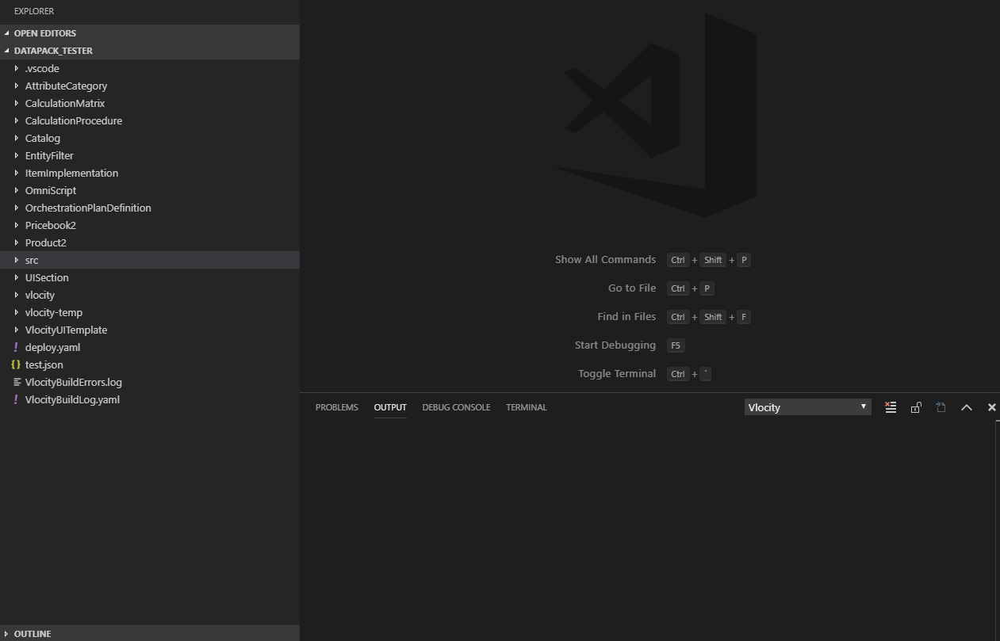

[](https://travis-ci.org/Codeneos/vlocode) 
[](https://github.com/Codeneos/vlocode) 
[![Technical Debt](https://img.shields.io/sonar/https/sonarcloud.io/curlybracket.vlocode/sqale_index.svg?color=lightgray&label=Technical%20Debt&logo=data%3Aimage%2Fpng%3Bbase64%2CiVBORw0KGgoAAAANSUhEUgAAAEAAAABACAMAAACdt4HsAAAAolBMVEUAAAD%2FZgD%2FZgD%2FZgD%2FZgD%2FZgD%2FZgD%2FZgD%2FZgD%2FZgD%2FZgD%2FZgD%2FZgD%2FZgD%2FZgD%2FZgD%2FZgD%2FZgD%2FZgD%2FZgD%2FZgD%2FZgD%2FZgD%2FZgD%2FZgD%2FZgD%2FZgD%2FZgD%2FZgD%2FZgD%2FZgD%2FZgD%2FZgD%2FZgD%2FZgD%2FZgD%2FZgD%2FZgD%2FZgD%2FZgD%2FZgD%2FZgD%2FZgD%2FZgD%2FZgD%2FZgD%2FZgD%2FZgD%2FZgD%2FZgD%2FZgD%2FZgD%2FZgD%2FZgCXdjhZAAAANXRSTlMA%2Bg335ykFAwnr7hDZON7Ie1ZDMfTUmIUUSSLPoVAa4r6K8rtyXD62gG2xpsKSjnZpYx6qTp5XIo8AAAOWSURBVFjD7VbZtqIwEGSVRXYQAVFBFvf16v%2F%2F2tgJKsYEvPM4Z%2FLiwV7SXV2phPu3lyB71fnserLwN9HD%2BGBL4u2%2BRMk%2BeMJvw887CH6uIKuGvwhXvIK%2FEYtf1sq38epRu1GWtFa%2FLH%2FPNxFFvq6q9aGQ8LeYC19hH2L30VFWm4p8Z4Tb2H%2BRYbBC%2B2urWfvfy1hHGZx%2BHNwFeBox4alMDfhfv%2FbFJxNUvvlpqVEGe9aTYAxe85pmihGWTne8bEGnJ7qx5KG5pDNBCZssBcZ8M7CeOkcILuKUCTAP6bvo5GuAE5P1ESAsyR0JKqhxzLYfACG3ZwY8dMDsoWcOKXDFZ9tNYFnYQeMNkPh09fzZgD5loMKWfYxrREOeF3VjU%2FqUHMn8bp8w5Elwl4tba2nbTwWRNSRPBUWeFHMjkgqirckMXuPDFx5hUtcSGU4b%2BemV3BHeSHpoUut2uirL8XYSwNfCJEDetjQyjFrtNyJmjE3cnBJ54b3dgmhVBgytfIRTpENChPQ8aYNSHxzy4DkoTrmMseju1XcRmg64L866eL0nj1ER4rkZ7oghQuScgadNWz5ijIVBzlkiRCDoQKOB25Dagqhw8ECGP%2FXGHwOEwKPvCj4184HMpk%2Fwo72IGpWfzEEjze8WGwqL%2BwrIMbNafrUO52LGefCb9RUwtFG82ybvBnaecsd%2BrQYEfgD0d6lZ4x6gFdGj3%2FLDV2H%2B0tr4FHVZcjaUllDnvppk8etrRqrxzAJUOQNIGLEEcHTpwAVpNIfSRCyFDcwOZu6ACbgC6o25Quj0VrAjhINAuWInuGAMUtiHyqMp333L1AFQmCuZbr7WSTHMoBVngpsd0UCCCetm50W88DihgB5c5mNjz0oQB3hnjNWOVoKpA8Amo4Dl4wwkBupFoR4AgGnIfq7M5ScYOq0JD9jO5wPmgwmDH%2B2Qpk0%2FKyjxa32lfsYjRZtcmo0kfJERE4vyoHnihgRT1TOK0J97ngLk92MOWk5XKKxZtiu0CvNTXNlReQmu2FzIbgLlKoJ8XuLtdQ0XUZxkAfzVyzSV8N02Vtvd6s2NN8%2FSMNzaEo%2B%2F525sPG5a%2BycM08xqLAtHfX8Kj26UlZmgRTzFYlTkbJK9RjrNHUSvYWmQFj2UKbQxQ6u1Fz8ay8ojuTMR24nTekAX0aQKd5am65KRHaZvo4vivDAkfaFZdnhOKOEt7ZR9XwYBJZeKLJf7LP4vYv0BK5jBy9A2z3IAAAAASUVORK5CYII%3D)](https://sonarcloud.io/dashboard?id=curlybracket.vlocode) 
[![Bugs](https://img.shields.io/sonar/https/sonarcloud.io/curlybracket.vlocode/bugs.svg?color=lightgray&label=bugs&logo=data%3Aimage%2Fpng%3Bbase64%2CiVBORw0KGgoAAAANSUhEUgAAAEAAAABACAMAAACdt4HsAAAAolBMVEUAAAD%2FZgD%2FZgD%2FZgD%2FZgD%2FZgD%2FZgD%2FZgD%2FZgD%2FZgD%2FZgD%2FZgD%2FZgD%2FZgD%2FZgD%2FZgD%2FZgD%2FZgD%2FZgD%2FZgD%2FZgD%2FZgD%2FZgD%2FZgD%2FZgD%2FZgD%2FZgD%2FZgD%2FZgD%2FZgD%2FZgD%2FZgD%2FZgD%2FZgD%2FZgD%2FZgD%2FZgD%2FZgD%2FZgD%2FZgD%2FZgD%2FZgD%2FZgD%2FZgD%2FZgD%2FZgD%2FZgD%2FZgD%2FZgD%2FZgD%2FZgD%2FZgD%2FZgD%2FZgCXdjhZAAAANXRSTlMA%2Bg335ykFAwnr7hDZON7Ie1ZDMfTUmIUUSSLPoVAa4r6K8rtyXD62gG2xpsKSjnZpYx6qTp5XIo8AAAOWSURBVFjD7VbZtqIwEGSVRXYQAVFBFvf16v%2F%2F2tgJKsYEvPM4Z%2FLiwV7SXV2phPu3lyB71fnserLwN9HD%2BGBL4u2%2BRMk%2BeMJvw887CH6uIKuGvwhXvIK%2FEYtf1sq38epRu1GWtFa%2FLH%2FPNxFFvq6q9aGQ8LeYC19hH2L30VFWm4p8Z4Tb2H%2BRYbBC%2B2urWfvfy1hHGZx%2BHNwFeBox4alMDfhfv%2FbFJxNUvvlpqVEGe9aTYAxe85pmihGWTne8bEGnJ7qx5KG5pDNBCZssBcZ8M7CeOkcILuKUCTAP6bvo5GuAE5P1ESAsyR0JKqhxzLYfACG3ZwY8dMDsoWcOKXDFZ9tNYFnYQeMNkPh09fzZgD5loMKWfYxrREOeF3VjU%2FqUHMn8bp8w5Elwl4tba2nbTwWRNSRPBUWeFHMjkgqirckMXuPDFx5hUtcSGU4b%2BemV3BHeSHpoUut2uirL8XYSwNfCJEDetjQyjFrtNyJmjE3cnBJ54b3dgmhVBgytfIRTpENChPQ8aYNSHxzy4DkoTrmMseju1XcRmg64L866eL0nj1ER4rkZ7oghQuScgadNWz5ijIVBzlkiRCDoQKOB25Dagqhw8ECGP%2FXGHwOEwKPvCj4184HMpk%2Fwo72IGpWfzEEjze8WGwqL%2BwrIMbNafrUO52LGefCb9RUwtFG82ybvBnaecsd%2BrQYEfgD0d6lZ4x6gFdGj3%2FLDV2H%2B0tr4FHVZcjaUllDnvppk8etrRqrxzAJUOQNIGLEEcHTpwAVpNIfSRCyFDcwOZu6ACbgC6o25Quj0VrAjhINAuWInuGAMUtiHyqMp333L1AFQmCuZbr7WSTHMoBVngpsd0UCCCetm50W88DihgB5c5mNjz0oQB3hnjNWOVoKpA8Amo4Dl4wwkBupFoR4AgGnIfq7M5ScYOq0JD9jO5wPmgwmDH%2B2Qpk0%2FKyjxa32lfsYjRZtcmo0kfJERE4vyoHnihgRT1TOK0J97ngLk92MOWk5XKKxZtiu0CvNTXNlReQmu2FzIbgLlKoJ8XuLtdQ0XUZxkAfzVyzSV8N02Vtvd6s2NN8%2FSMNzaEo%2B%2F525sPG5a%2BycM08xqLAtHfX8Kj26UlZmgRTzFYlTkbJK9RjrNHUSvYWmQFj2UKbQxQ6u1Fz8ay8ojuTMR24nTekAX0aQKd5am65KRHaZvo4vivDAkfaFZdnhOKOEt7ZR9XwYBJZeKLJf7LP4vYv0BK5jBy9A2z3IAAAAASUVORK5CYII%3D)](https://sonarcloud.io/dashboard?id=curlybracket.vlocode) 
[![Vulnerabilities](https://img.shields.io/sonar/https/sonarcloud.io/curlybracket.vlocode/vulnerabilities.svg?label=vulnerabilities&logo=data%3Aimage%2Fpng%3Bbase64%2CiVBORw0KGgoAAAANSUhEUgAAAEAAAABACAMAAACdt4HsAAAAolBMVEUAAAD%2FZgD%2FZgD%2FZgD%2FZgD%2FZgD%2FZgD%2FZgD%2FZgD%2FZgD%2FZgD%2FZgD%2FZgD%2FZgD%2FZgD%2FZgD%2FZgD%2FZgD%2FZgD%2FZgD%2FZgD%2FZgD%2FZgD%2FZgD%2FZgD%2FZgD%2FZgD%2FZgD%2FZgD%2FZgD%2FZgD%2FZgD%2FZgD%2FZgD%2FZgD%2FZgD%2FZgD%2FZgD%2FZgD%2FZgD%2FZgD%2FZgD%2FZgD%2FZgD%2FZgD%2FZgD%2FZgD%2FZgD%2FZgD%2FZgD%2FZgD%2FZgD%2FZgD%2FZgCXdjhZAAAANXRSTlMA%2Bg335ykFAwnr7hDZON7Ie1ZDMfTUmIUUSSLPoVAa4r6K8rtyXD62gG2xpsKSjnZpYx6qTp5XIo8AAAOWSURBVFjD7VbZtqIwEGSVRXYQAVFBFvf16v%2F%2F2tgJKsYEvPM4Z%2FLiwV7SXV2phPu3lyB71fnserLwN9HD%2BGBL4u2%2BRMk%2BeMJvw887CH6uIKuGvwhXvIK%2FEYtf1sq38epRu1GWtFa%2FLH%2FPNxFFvq6q9aGQ8LeYC19hH2L30VFWm4p8Z4Tb2H%2BRYbBC%2B2urWfvfy1hHGZx%2BHNwFeBox4alMDfhfv%2FbFJxNUvvlpqVEGe9aTYAxe85pmihGWTne8bEGnJ7qx5KG5pDNBCZssBcZ8M7CeOkcILuKUCTAP6bvo5GuAE5P1ESAsyR0JKqhxzLYfACG3ZwY8dMDsoWcOKXDFZ9tNYFnYQeMNkPh09fzZgD5loMKWfYxrREOeF3VjU%2FqUHMn8bp8w5Elwl4tba2nbTwWRNSRPBUWeFHMjkgqirckMXuPDFx5hUtcSGU4b%2BemV3BHeSHpoUut2uirL8XYSwNfCJEDetjQyjFrtNyJmjE3cnBJ54b3dgmhVBgytfIRTpENChPQ8aYNSHxzy4DkoTrmMseju1XcRmg64L866eL0nj1ER4rkZ7oghQuScgadNWz5ijIVBzlkiRCDoQKOB25Dagqhw8ECGP%2FXGHwOEwKPvCj4184HMpk%2Fwo72IGpWfzEEjze8WGwqL%2BwrIMbNafrUO52LGefCb9RUwtFG82ybvBnaecsd%2BrQYEfgD0d6lZ4x6gFdGj3%2FLDV2H%2B0tr4FHVZcjaUllDnvppk8etrRqrxzAJUOQNIGLEEcHTpwAVpNIfSRCyFDcwOZu6ACbgC6o25Quj0VrAjhINAuWInuGAMUtiHyqMp333L1AFQmCuZbr7WSTHMoBVngpsd0UCCCetm50W88DihgB5c5mNjz0oQB3hnjNWOVoKpA8Amo4Dl4wwkBupFoR4AgGnIfq7M5ScYOq0JD9jO5wPmgwmDH%2B2Qpk0%2FKyjxa32lfsYjRZtcmo0kfJERE4vyoHnihgRT1TOK0J97ngLk92MOWk5XKKxZtiu0CvNTXNlReQmu2FzIbgLlKoJ8XuLtdQ0XUZxkAfzVyzSV8N02Vtvd6s2NN8%2FSMNzaEo%2B%2F525sPG5a%2BycM08xqLAtHfX8Kj26UlZmgRTzFYlTkbJK9RjrNHUSvYWmQFj2UKbQxQ6u1Fz8ay8ojuTMR24nTekAX0aQKd5am65KRHaZvo4vivDAkfaFZdnhOKOEt7ZR9XwYBJZeKLJf7LP4vYv0BK5jBy9A2z3IAAAAASUVORK5CYII%3D)](https://sonarcloud.io/dashboard?id=curlybracket.vlocode)

# **Vlocode**: Vlocity/Salesforce development integration for Visual Studio Code

This extension provides functionality for deploying, extracting, and refreshing **Vlocity metadata** with Visual Studio Code.
It is targeted at **Vlocity/Salesforce developers** who work with **Vlocity (Salesforce Industries)** and **Salesforce Metadata**.

Vlocode makes your life as a _Salesforce_ or _Vlocity_ developer easier by providing you with a set of powerful commands to work with both Salesforce as well as Vlocity (Salesforce Industries) Metadata. 

_Vlocode is an additive extension to the SFDX extension pack from Salesforce_

## Notable features of **Vlocode**
* Direct access to the **Developer/Debug Logs** through a new UI pannel.
* **Auto creates -meta.xml files** for you when you create an APEX class or APEX Trigger
* Allows you to **open** exported **Metadata directly in Salesforce** through a context menu action
* Change the debug log level on the connected org
* **Delete all debug logs** on the connected org directly from the *Developer/Debug Logs panel
* Execute anonymous APEX and directly open the log as if you were working from the developer console
* Full support for packaging and **deploying SFDX** metadata 
* Powerful **Vlocity Metadata browser** to export and open Vlocity Metadata
* Commands to directly execute common **Vlocity CMT Admin commands** such as Refresh Product Hierarchy

This extension embeds the popular libraries such as JSForce, SFDX (_@salesforce/core_) and the Vlocity build tools library allowing you to directly manipulate your Salesforce org from within your IDE. As opposed to the official SFDX extension Vlocode aims at providing a more guide and integrated experience. You can (and should) use Vlocode next to the official SFDX extension pack.

All settings for Vlocode in the `.vscode` settings file making it easy to maintain and change. You can use a special `.vlocode` config file to define project defaults which can be versioned in git. See the bottom of this readme which describes how to use a `.vlocode` config file.

## All Features

### Salesforce
* **Export metadata** export all Salesforce metadata from the Command Pallet

* **Auto create and update -meta.xml files** automatically rename and create _-meta.xml_ files when you create or rename APEX classes
* **Advance metadata deployments**
  * Support deployment of both __SFDX__ and __Classic__ Metadata format
  * Support mixed source code deployment with Netadata defined both in SFDX format as well as in classic format 
* **Support LWC/Aura** support for both LWC and Aura deployments
* **Deploy on save** automatically deploy Salesforce Metadata to the connected org on save
* **Deploy multiple metadata files** deploy one or more Salesforce Metadata components directly from within VSCode
* **Refresh/Export metadata** refresh or export one or more Salesforce Metadata components with a single click of your mouse
* **Easy creation of APEX classes** automatically generate a boiler plate class definitions and -meta.xml file for APEX Classes, Triggers and more
* **Execute anonymous** execute anonymous APEX with a configurable log level and profiling and directly open the log in VSCode after execution
* **Execute Salesforce REST APIs** easy Salesforce RESP API testing directlly opening the response in VScode
* **Delete metadata from org** delete Salesforce Metadata components from your org from within vscode
* ** Salesforce Logs viewer** using the integrated Log viewer you can view and open Salesforce debug logs directly from VSCode


### Vlocity
* **Retrieve & refresh** Vlocity datapacks from within Visual Studio Code simplifying your workflow
* **Deploy** exported Vlocity datapacks with a single click from within Visual Studio Code
* **Export** any datapack enabled object directly from within VSCode.
* **Run Yaml Job** Run any YAML job file directly from VSCode.

* **Open in Salesforce** directly open any Vlocity object in Salesforce.
* **Clone Datapack** clone any Datapack object from your IDE, usefull for cloning products or templates directly from VSCode
* **Rename Datapack** change the name of a Datapack and rebuild the file structure to match the new name
* **Rebuild parentkeys** rebuild and verify your source code for missing dependencies and rebuild the dependency graph
* **Check Integrity** Check datapack integrity by finding missing references and rebuilding ParentKey files
* **Admin Commands** Vlocode integrates common admin commands for Vlocity:
  * **Refresh Pricebook** Refreshes pricebook entries on the currently connected Salesforce org
  * **Refresh Product Hierarchy** Refresh the product hierarchy cache for the Vlocity CPQ
  * **Update Product Attributes (JSON)** Refresh the product attribute JSON definitions based on the attribute assignments

* **Datapack explorer** view all exportable objects available in the connected org and export them with a single click

* **Easy setup** Simplified setup based on SFDX using session tokens instead; no need to acquire security tokens or copy-past passwords and usernames around.
* **SFDX Support** username or alias to login to Salesforce

## Requirements

- Basic knowledge of Vlocity datapacks
- Access to an Salesforce instance with the Vlocity managed package installed

## Using a `.vlocode` config rule
Instead of configuring Vlocode through VSCodes workspace and user level settings you can also override configuration settings using a workspace-folder `.vlocode`-file. This allows to force a certain configuration value and can be usefull to ensure all developers on the project use the same configuration for exporting *vlocity* and *Salesforce* metadata

**Sample of a `.vlocode` configuration-file**
```json
{
    "customJobOptionsYaml": "./vlocity/dataPacksJobs/default.yaml",
    "projectPath": "./vlocity/src",
    "salesforce": { 
        "apiVersion": "48.0"
    }
}
```
## Extension Settings

This extension contributes the following settings:

* `vlocity.projectPath`: Path to the folder containing the Vlocity datapacks relative to the workspace's root folder, for example:
  - `./vlocity`
  - `./datapacks`
* `vlocity.verbose`: Enable verbose logging to the output window
* `vlocity.activate`: Automatically activate deployed datapacks
* `vlocity.customJobOptionsYaml`: Path to the custom YAML that is used during deployment and export, see the official Vlocity Build repository for [documentation](https://github.com/vlocityinc/vlocity_build#additional-command-line-options) on the format of this file.
* `vlocity.sfdxUsername`: SFDX username; when this is specified the username, password, loginUrl and instanceUrl are ignored.
